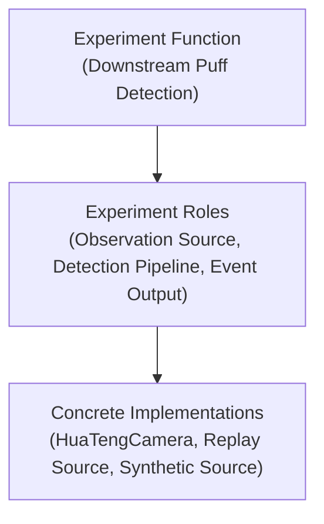

# Experiment Canvas Architecture

## Purpose

This document defines the high-level `Experiment Canvas` model for Orchestral.

The canvas exists to help a user and the embedded AI co-build the system at a high level before concrete hardware integration is complete.

The canvas should therefore use high-level blocks, not vendor-first device blocks.

## Core Principle

Top-level canvas blocks should represent `Experiment Functions`.

They should not start as:

- concrete device models,
- SDK wrappers,
- serial ports,
- or panel-local widgets.

This is because the user usually thinks in terms such as:

- downstream puff detection,
- Reynolds regulation,
- temperature monitoring,
- trigger generation,
- run recording.

Those are broader than one device and often include processing, control, and derived-state logic as well as hardware.

## Three-Layer Canvas Model

The canvas should be understood as three connected layers:

1. `Experiment Function`
2. `Experiment Role`
3. `Concrete Implementation`

### 1. Experiment Function

An experiment function is the top-level scientific or system job to be done.

Examples:

- `Downstream Puff Detection`
- `Upstream Verification`
- `Reynolds Regulation`
- `Temperature Monitoring`
- `Run Recording`

This is the correct top-level abstraction for the canvas because it matches how a user describes what the system should accomplish.

### 2. Experiment Role

An experiment role is a meaningful sub-role required to realize an experiment function.

Examples inside `Downstream Puff Detection`:

- observation source
- frame stream
- image-processing pipeline
- detector output

Examples inside `Reynolds Regulation`:

- measured-state source
- command-capable actuator role
- control-target role

Roles are still abstract.
They describe what is needed, not yet which concrete implementation provides it.

### 3. Concrete Implementation

A concrete implementation is the real or virtual implementation bound to a role.

Examples:

- `HuaTengCamera`
- `IntegratedCamera`
- `PT104`
- `ControlCenter.FlowTelemetry`
- a virtual camera service
- a replay source
- a synthetic scalar source

Concrete implementations are where runtime sessions, device services, and transport specifics become relevant.

## Relationship Between The Layers

The layers should compose like this:

One function may require multiple roles.
One role may be fulfilled by different concrete implementations.
One concrete implementation may serve different roles in different experiments.

## Why The Canvas Starts Above Roles

An experiment role is already more abstract than a device, but it is still often too low-level for the first co-design phase.

Example:

- `Downstream observation camera`

is narrower than:

- `Downstream Puff Detection`

The latter may include:

- observation,
- image streaming,
- image processing,
- event detection,
- binary or timed output generation.

So the canvas should start from the broader function and only later expand into the lower layers.

## Canvas Authoring Intent

In the earliest design phase, a function block may have:

- no concrete implementation yet,
- no physical hardware attached,
- only intended inputs, outputs, and logic responsibility.

This is acceptable and expected.

The canvas is therefore an authoring and planning surface first, not only a hardware inventory surface.

## Binding To Runtime

The canvas should not bypass the runtime architecture.

Instead:

- experiment functions expand into roles,
- roles bind to concrete implementations,
- concrete implementations attach to Orchestral runtime services and sessions,
- runtime sessions then feed monitor, controller, recorder, and experiment-logic units.

So the canvas remains high-level while the runtime remains truthful.

## Relationship To Experiment Logic

The experiment canvas sits conceptually above the runtime foundation and is closely aligned with the experiment-logic layer.

The canvas should answer:

- what experiment functions exist?
- what roles are needed inside each function?
- what outputs should each function produce?

The experiment-logic layer should then implement the experiment-specific meaning implied by those functions.

## Concrete Implementations And Source Modes

Concrete implementations should not be limited to real hardware.

They may run in different source modes:

- `Real`
- `Virtual`
- `Replay`
- `Synthetic`

This means one experiment function can remain stable while its concrete implementation changes.

## Non-Goals

This document does not yet define:

- exact canvas UI controls
- block visuals
- drag/drop behavior
- how function blocks expand in the editor
- how implementation pickers should look

Those are later UI/interaction decisions.

This document only fixes the architecture and vocabulary.
