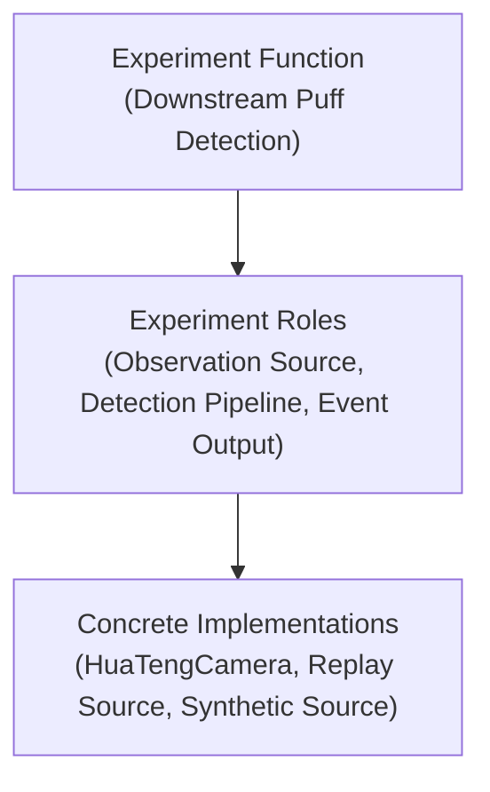

# Experiment Canvas Architecture

## Purpose

This document defines the high-level `Experiment Canvas` model for Orchestral.

The canvas exists to help a user and the embedded AI co-build the system at a high level before concrete hardware integration is complete.

The canvas should therefore use high-level blocks, not vendor-first device blocks.

Read this together with:

- [EXPERIMENT_CANVAS_BLOCK_CONTRACT.md](./EXPERIMENT_CANVAS_BLOCK_CONTRACT.md)
- [EXPERIMENT_CANVAS_TYPED_BLOCK_KINDS.md](./EXPERIMENT_CANVAS_TYPED_BLOCK_KINDS.md)

## Core Principle

Top-level canvas blocks should represent `Experiment Functions`.

They should not start as:

- concrete device models,
- SDK wrappers,
- serial ports,
- or panel-local widgets.

This is because the user usually thinks in terms such as:

- downstream puff detection,
- Reynolds regulation,
- temperature monitoring,
- trigger generation,
- run recording.

Those are broader than one device and often include processing, control, and derived-state logic as well as hardware.

## General Top-Level Experiment Pattern

At the highest level, the canvas should stay sparse.

The general top-level pattern should use four experiment-function classes:

1. `condition_control`
2. `core_experiment_function`
3. `order_parameter`
4. `data_recording`

In V1, this should be treated as a closed set of canonical top-level function classes.

Not every experiment must use all four.

These four classes are a top-level authoring scaffold.
They exist to help the user and the AI think systemically about the experiment before diving into lower-level bindings or device details.

They should not be read as required runtime execution partitions.
The runtime may still start directly through the coordinator, and monitor or recorder surfaces may still subscribe directly to runtime-published values, images, and events.

Their canonical meanings are defined in:

- [SYSTEM_LANGUAGE_SPEC.md](./SYSTEM_LANGUAGE_SPEC.md)

The following should normally **not** be top-level experiment-function blocks:

- monitor or dashboard surfaces
- device init or terminate lifecycle behavior
- generic runtime orchestration
- calibration or reference logic that only supports a parent block

Calibration or reference work may still exist as nested support blocks, but it should not be promoted to top level merely because it is scientifically important.
Promotion should happen only when that calibration/reference work has its own independent schedule, outputs, or operator-visible identity in the experiment design.

### Turbulence Example Mapping

For the turbulence experiment, the same general classes can be mapped as:

- `Re Control Unit` -> `condition_control`
- `Puff Control Unit` -> `core_experiment_function`
- `TF Unit` -> `order_parameter`
- `Data Recording Unit` -> `data_recording`

This example is only a mapping example.
It should not be read as a requirement to rebuild the turbulence experiment literally.

## Three-Layer Canvas Model

The canvas should be understood as three connected layers:

1. `Experiment Function`
2. `Experiment Role`
3. `Concrete Implementation`

The V1 block-level rules for how those layers appear inside one block are defined in:

- [EXPERIMENT_CANVAS_BLOCK_CONTRACT.md](./EXPERIMENT_CANVAS_BLOCK_CONTRACT.md)
- [EXPERIMENT_CANVAS_TYPED_BLOCK_KINDS.md](./EXPERIMENT_CANVAS_TYPED_BLOCK_KINDS.md)

### 1. Experiment Function

An experiment function is the top-level scientific or system job to be done.

Examples:

- `Downstream Puff Detection`
- `Upstream Verification`
- `Reynolds Regulation`
- `Temperature Monitoring`
- `Run Recording`

This is the correct top-level abstraction for the canvas because it matches how a user describes what the system should accomplish.

### 2. Experiment Role

An experiment role is a meaningful sub-role required to realize an experiment function.

Examples inside `Downstream Puff Detection`:

- observation source
- frame stream
- image-processing pipeline
- detector output

Examples inside `Reynolds Regulation`:

- measured-state source
- command-capable actuator role
- control-target role

Roles are still abstract.
They describe what is needed, not yet which concrete implementation provides it.

### 3. Concrete Implementation

A concrete implementation is the real or virtual implementation bound to a role.

Examples:

- `HuaTengCamera`
- `IntegratedCamera`
- `PT104`
- `ControlCenter.FlowTelemetry`
- a virtual camera service
- a replay source
- a synthetic scalar source

Concrete implementations are where runtime sessions, device services, and transport specifics become relevant.

## Relationship Between The Layers

The layers should compose like this:

One function may require multiple roles.
One role may be fulfilled by different concrete implementations.
One concrete implementation may serve different roles in different experiments.

In V1, one function block may contain multiple internal roles, but each role should bind to exactly one active concrete implementation.

At design time, the canvas block is the source of truth for the intended role-to-implementation bindings inside that function.
At run time, the resolved run manifest is the source of truth for what was actually executed.

At the highest level, these blocks should still be scientist-facing experiment functions rather than runtime concerns such as monitoring, lifecycle control, or generic orchestration.

## Typed Internal Composition

Top-level experiment-function blocks should be understood as the highest layer of canvas composition, not the only layer.

Below that top level, a function may be decomposed through reusable typed block kinds such as:

- `FunctionBlock`
- `PipelineBlock`
- `ComputeBlock`
- `ControlBlock`
- `BindingBlock`

Those lower-level typed block kinds are defined in:

- [EXPERIMENT_CANVAS_TYPED_BLOCK_KINDS.md](./EXPERIMENT_CANVAS_TYPED_BLOCK_KINDS.md)

This decomposition vocabulary exists to make nested canvas structure legible.
It does not require the runtime to instantiate one hard execution container for each canvas block.

## Why The Canvas Starts Above Roles

An experiment role is already more abstract than a device, but it is still often too low-level for the first co-design phase.

Example:

- `Downstream observation camera`

is narrower than:

- `Downstream Puff Detection`

The latter may include:

- observation,
- image streaming,
- image processing,
- event detection,
- binary or timed output generation.

So the canvas should start from the broader function and only later expand into the lower layers.

## Canvas Authoring Intent

In the earliest design phase, a function block may have:

- no concrete implementation yet,
- no physical hardware attached,
- only intended inputs, outputs, and logic responsibility.

This is acceptable and expected.

The canvas is therefore an authoring and planning surface first, not only a hardware inventory surface.

Its readiness indicators should therefore express:

- structural readiness,
- binding completeness,
- and source-mode trust level,

not live run control state.

The exact V1 readiness semantics are defined in:

- [EXPERIMENT_CANVAS_BLOCK_CONTRACT.md](./EXPERIMENT_CANVAS_BLOCK_CONTRACT.md)

## Binding To Runtime

The canvas should not bypass the runtime architecture.

Instead:

- experiment functions expand into roles,
- roles bind to concrete implementations,
- concrete implementations attach to Orchestral runtime services and sessions,
- runtime sessions then feed monitor, controller, recorder, and experiment-logic units.

This means the canvas can stay high-level without forcing start/stop flow, monitor subscriptions, or recorder wiring to route through one top-level canvas block per function class.

So the canvas remains high-level while the runtime remains truthful.

## Relationship To Experiment Logic

The experiment canvas sits conceptually above the runtime foundation and is closely aligned with the experiment-logic layer.

The canvas should answer:

- what experiment functions exist?
- what roles are needed inside each function?
- what outputs should each function produce?

The experiment-logic layer should then implement the experiment-specific meaning implied by those functions.

## Concrete Implementations And Source Modes

Concrete implementations should not be limited to real hardware.

They may run in different source modes:

- `Real`
- `Virtual`
- `Replay`
- `Synthetic`

This means one experiment function can remain stable while its concrete implementation changes.

## Non-Goals

This document does not yet define:

- exact canvas UI controls
- block visuals
- drag/drop behavior
- how function blocks expand in the editor
- how implementation pickers should look

Those are later UI/interaction decisions.

This document only fixes the architecture and vocabulary.
