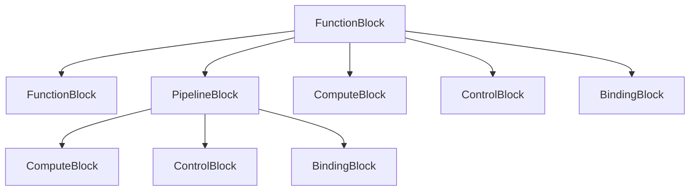

# Experiment Canvas Typed Block Kinds

## Purpose

This document defines the first lower-level typed block kinds for the Orchestral experiment canvas.

The goal is to let the canvas decompose a high-level experiment function into legible internal structure without collapsing back into vendor-first device boxes or forcing every runtime concern to become a top-level block.

Read this together with:

- [EXPERIMENT_CANVAS_ARCHITECTURE.md](./EXPERIMENT_CANVAS_ARCHITECTURE.md)
- [EXPERIMENT_CANVAS_BLOCK_CONTRACT.md](./EXPERIMENT_CANVAS_BLOCK_CONTRACT.md)
- [SYSTEM_LANGUAGE_SPEC.md](./SYSTEM_LANGUAGE_SPEC.md)

## Core Rule

Top-level canvas blocks are still `Experiment Functions`.

Those top-level blocks should be treated as `FunctionBlock` instances with an added top-level `function_class` such as:

- `condition_control`
- `core_experiment_function`
- `order_parameter`
- `data_recording`

The lower-level typed block kinds in this document exist to describe what can appear inside or below those top-level function blocks.

## Canonical Typed Block Kinds

### 1. `FunctionBlock`

A `FunctionBlock` is a meaningful subsystem with a clear purpose, inputs, outputs, and responsibility boundary.

Use it when the user should be able to answer:

- what does this subsystem do?
- what does it consume?
- what does it produce?

Examples:

- `Puff Control Unit`
- `Downstream Puff Detection`
- `Reynolds Regulation`
- `TF Unit`
- `Data Recording Unit`

A `FunctionBlock` may appear:

- at the top level as an experiment function,
- or nested inside another function block when a lower-level subsystem deserves explicit identity.

### 2. `PipelineBlock`

A `PipelineBlock` is an ordered processing path where stage order is semantically important.

Use it when the main meaning is:

- first this happens,
- then this happens,
- then the next stage consumes the previous stage output.

Examples:

- `Frame Conditioning Pipeline`
- `Signal Extraction Pipeline`
- `Raw Stream Recording Pipeline`

A pipeline is a structural expression of ordered processing, not merely a visual group.

### 3. `ComputeBlock`

A `ComputeBlock` derives or calculates outputs from inputs.

It should be used for transformations, reductions, estimators, aggregations, and derived-state calculations that do not directly own hardware actuation.

Examples:

- Reynolds-number derivation
- laminar background estimation
- event accumulation
- turbulence-fraction calculation

### 4. `ControlBlock`

A `ControlBlock` turns targets, measurements, conditions, or events into decisions or commands.

It is the right kind when the block is deciding, gating, scheduling, or commanding rather than merely calculating.

Examples:

- setpoint scheduler
- feedback controller
- puff-trigger gate
- actuator enable/disable policy

### 5. `BindingBlock`

A `BindingBlock` is the leaf block that connects an abstract role, port, or boundary edge to a concrete implementation.

This is where the canvas crosses from abstract experiment structure into a chosen implementation such as:

- `Real`
- `Virtual`
- `Replay`
- `Synthetic`

Examples:

- `HuaTengCamera` binding
- `PT104` temperature binding
- replay frame source binding
- synthetic scalar source binding

A `BindingBlock` should normally be treated as a leaf.
It should not contain child blocks of its own in V1.

## How They Compose

The canonical composition model is:

This should be read as a structural allowance model, not as a required runtime class hierarchy.

### Composition Rules

1. `FunctionBlock` is the main composition container.

It may contain:

- nested `FunctionBlock`
- `PipelineBlock`
- `ComputeBlock`
- `ControlBlock`
- `BindingBlock`

2. `PipelineBlock` expresses ordered stages.

It may contain stage-local:

- `ComputeBlock`
- `ControlBlock`
- nested `PipelineBlock`
- boundary `BindingBlock` when a pipeline starts from or ends at a concrete implementation

3. `ComputeBlock` and `ControlBlock` are internal working blocks.

They normally sit inside:

- `FunctionBlock`
- or `PipelineBlock`

They may feed:

- other compute blocks
- control blocks
- function outputs
- recording paths

4. `BindingBlock` is the boundary leaf.

It is the place where abstract structure connects to a concrete implementation.
It should normally terminate a branch rather than contain more decomposition.

## What These Kinds Are Not

These block kinds are:

- a design-time and decomposition vocabulary,
- a way to make internal experiment structure legible,
- and a bridge between high-level experiment functions and lower-level bindings.

They are not:

- a promise that the runtime must instantiate one execution container per block,
- a thread model,
- a process model,
- or a required dashboard layout.

In particular:

- `Start` does not need to route through one runtime container per top-level function block,
- monitor surfaces may subscribe directly to runtime-published values, images, and summaries,
- recorder paths may bind directly to runtime streams and artifacts.

## General Example

A top-level `FunctionBlock` such as `Condition Control` may contain:

- one nested `FunctionBlock` for measured-state acquisition,
- one `ComputeBlock` for derived-state calculation,
- one `ControlBlock` for target tracking,
- and several `BindingBlock` leaves for actuator and sensor implementations.

A top-level `FunctionBlock` such as `Core Experiment Function` may contain:

- one nested detection `FunctionBlock`,
- one `PipelineBlock` for ordered signal or image processing,
- one `ControlBlock` for trigger or actuation policy,
- and one or more `BindingBlock` leaves for observation and actuation implementations.

## Turbulence Example

For the turbulence experiment, one possible decomposition is:

- `Re Control Unit`
  - `FunctionBlock`
  - contains:
    - `ComputeBlock`: Reynolds derivation
    - `ControlBlock`: Re setpoint controller
    - `BindingBlock`: flow telemetry implementation
    - `BindingBlock`: temperature implementation
    - `BindingBlock`: actuator implementation
- `Puff Control Unit`
  - `FunctionBlock`
  - contains:
    - nested `FunctionBlock`: downstream puff detection
    - nested `FunctionBlock`: upstream validation
    - `PipelineBlock`: frame-conditioning and signal-extraction path
    - `ControlBlock`: puff-trigger or perturbation gate
    - `BindingBlock`: camera implementation
    - `BindingBlock`: actuator implementation
- `TF Unit`
  - `FunctionBlock`
  - contains:
    - `ComputeBlock`: event accumulator
    - `ComputeBlock`: TF calculation
- `Data Recording Unit`
  - `FunctionBlock`
  - contains:
    - `PipelineBlock`: raw and derived stream capture path
    - `BindingBlock`: recording implementation

This example is only a structural illustration.
It should not be read as a requirement to rebuild turbulence literally.

## V1 Boundary

V1 should keep these typed block kinds as a semantic and structural model first.

That means:

- top-level canvas blocks remain experiment functions,
- the lower-level kinds explain decomposition below that boundary,
- and the runtime may still execute through its existing coordinator, sessions, streams, monitors, controller units, and recorder units without creating one hard runtime partition per block.
