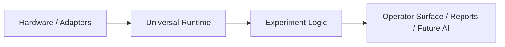
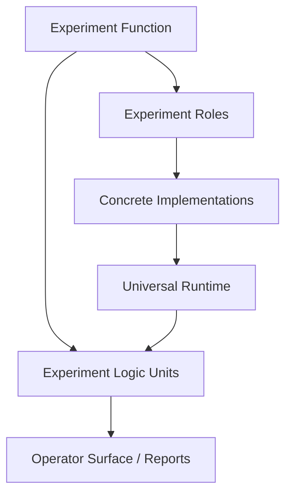

# Experiment Logic Layer

## Purpose

This document defines the `Experiment Logic` layer in Orchestral.

This layer exists so that experiment-specific scientific meaning, derived state, processing, detection, and control policy do not get mixed into the universal runtime foundation.

In simple words:

- the universal runtime knows how to run devices, sessions, streams, coordination, monitoring, and recording
- the experiment-logic layer knows what those things mean for one scientific experiment

## Why This Layer Is Needed

The current runtime foundation is now strong enough that the next missing work is no longer "more generic runtime."

The next missing work often looks like:

- two cameras that together mean `upstream` and `downstream`
- Reynolds number derived from pulse telemetry, temperature, and geometry
- turbulence signals derived from image sequences
- puff detection derived from processed signals
- experiment-specific stop rules and control policies

Those are real system units, but they are not universal hardware/runtime units.

If Orchestral keeps treating them as universal:

- the runtime layer becomes experiment-shaped
- reuse gets worse instead of better
- roadmap sequencing becomes confusing
- experiment-specific assumptions leak into supposedly generic APIs

So the project needs a formal boundary:

- universal runtime below
- experiment logic above

The experiment canvas should sit on the same side of this boundary as experiment logic.

That means:

- top-level canvas blocks represent `Experiment Functions`,
- those functions expand into `Experiment Roles`,
- and those roles later bind to `Concrete Implementations`.

Experiment logic is the code and runtime meaning that make those high-level function blocks real.

## Layer Boundaries

### Universal Runtime Foundation

This layer should remain reusable across many experiments.

Examples:

- device sessions
- session registry
- snapshot and stream ports
- runtime coordinator
- stop authority
- run context and metadata
- recorder and artifact writer
- generic controller-unit infrastructure
- generic monitor infrastructure

This layer answers questions like:

- how do we own one active device connection?
- how do we start and stop a run?
- how do we publish streams and snapshots?
- how do we record what happened?

### Experiment Logic

This layer uses the runtime foundation to express experiment-specific meaning.

Examples:

- camera-pair semantics such as `upstream` and `downstream`
- Reynolds-number derivation
- grouped temperature interpretation
- image-to-signal transforms
- event detection and classification
- experiment-specific control-target wiring
- experiment-specific monitor rules
- experiment-specific stop-condition logic

This layer answers questions like:

- what does this stream mean scientifically?
- how do several devices work together in this experiment?
- what derived state is important for this experiment?
- what detection/control logic belongs to this experiment?
- how does one high-level experiment function decompose into roles, transforms, detectors, controllers, and outputs?

### AI Orchestration

This remains above both layers.

Examples:

- guidance
- experiment setup help
- downstream routing help
- report assistance
- future planning or automation support

The AI layer should consume stable runtime and experiment-logic surfaces, not invent them.

## Relationship To Runtime

Experiment logic should run *on top of* the runtime foundation, not beside it and not below it.

That means:

- experiment-logic units consume runtime streams, snapshots, and commands
- experiment-logic units do not read raw device SDKs or serial APIs directly
- experiment-logic units can publish new derived streams, summaries, or control decisions back into the runtime-facing system

So the layering is:

For canvas-oriented design and binding, the conceptual mapping is:

Examples:

- `FlowReynoldsDerivedStateSession`
  - consumes control-center pulse telemetry and PT-104 temperature from runtime sessions
  - publishes derived Reynolds/flow state
- future `CameraPairLogicUnit`
  - consumes two camera-session outputs
  - publishes pair-level health and semantics
- future `PuffDetectionUnit`
  - consumes processed experiment streams
  - publishes event streams and monitor state

The current `ControllerUnitSession` and `ExperimentMonitorSession` should be read as **runtime infrastructure slots**, not as experiment logic by themselves.

They provide the reusable host surfaces for:

- control-target evaluation,
- measured-value presentation,
- monitor aggregation,
- run-facing summaries.

The experiment-specific policies, rules, and projections plugged into those reusable slots are experiment logic.

In other words:

- `ControllerUnitSession` is runtime infrastructure
- a specific experiment's control policy is experiment logic
- `ExperimentMonitorSession` is runtime infrastructure
- a specific experiment's monitor rules and derived summaries are experiment logic

`Experiment plane` should therefore be read as the umbrella term for everything above raw device sessions, while `Experiment Logic` is the experiment-specific layer within that broader plane.

## What Belongs In Experiment Logic

Use this rule:

- if the unit still makes sense across many different experiments, it probably belongs in universal runtime
- if the unit depends on one experiment's scientific meaning, coupling, or interpretation, it belongs in experiment logic

Belongs here:

- composite role meaning
- derived scientific state
- experiment-specific transforms
- experiment-specific detectors
- experiment-specific control policies
- experiment-specific monitor aggregation

Does not belong here:

- raw device connection ownership
- generic stream buffering
- panel shell styling
- generic run lifecycle
- generic artifact persistence

## Representation

This layer should be expressed in **both docs and code**.

### Docs

Docs define:

- the architectural boundary
- the intended units
- the ownership model
- what is universal vs experiment-specific

### Code

Code implements:

- derived-state sessions
- logic units
- transforms
- detectors
- experiment-specific control/monitor behavior

The doc should guide implementation.
The doc should not be the implementation.

## First Identified Experiment-Logic Units

These units should now be treated as experiment-logic work, not universal runtime work:

- `FlowReynoldsDerivedStateSession`
- `camera-pair role unit`
- `image-to-signal processing pipeline`
- `detection / classification / trigger-conversion unit`
- experiment-specific grouped controller projections
- experiment-specific monitor and alarm rules

`FlowReynoldsDerivedStateSession` is the first concrete proof that this layer is needed:

- it uses universal runtime infrastructure
- but the logic itself is specific to an experiment domain

## Build Guidance

When planning future work:

1. build universal runtime only until the reusable boundary is solid
2. move experiment-specific meaning into experiment logic
3. only then build the specific reference experiment units on that layer

So the next units after this document should come from the experiment-logic layer, not from another round of first-generation runtime creation by reflex.

Before broad experiment-logic expansion, Orchestral should still finish the small remaining set of universal hardening units:

- control-center capability decomposition
- cross-session validation
- experiment-definition linting
- virtual device and replay/simulation harness

After those are done, the minimum code-level proof of this layer should use the already-built Reynolds logic as the first experiment-logic boundary test.

That minimum proof should:

- give experiment logic an explicit code-level home,
- keep runtime infrastructure reusable,
- and prove that one experiment-logic unit can consume runtime outputs and still feed controller, monitor, and recorder correctly.

## Success Criterion

This layer is successful when:

- experiment-specific units stop being proposed as universal runtime units
- future planning clearly separates reusable runtime from experiment-specific meaning
- derived scientific state and composite role logic are implemented on top of runtime instead of distorting it
- the first reference experiment can be built as a coherent experiment-logic package rather than as scattered special cases
