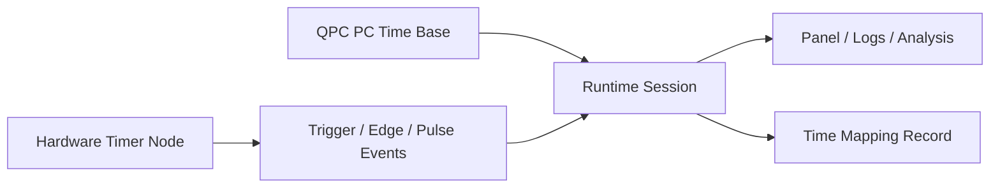

# Timing And Synchronization Strategy

## Purpose

This document defines how Orchestral should think about time on the PC side, on attached hardware, and across mixed-device experiments.

The goal is to prevent a common category error:

- confusing `precise timestamping` with `deterministic execution`.

Orchestral needs both, but they should not be implemented by the same mechanism by default.

Read this together with:

- [DEVICE_RUNTIME_IO_ARCHITECTURE.md](C:/Users/Yi%20Zhuang/OneDrive/Codes/Projects/Orchestral/docs/architecture/DEVICE_RUNTIME_IO_ARCHITECTURE.md)
- [INTEGRATION_PANEL_IO_CONTRACT.md](C:/Users/Yi%20Zhuang/OneDrive/Codes/Projects/Orchestral/docs/architecture/INTEGRATION_PANEL_IO_CONTRACT.md)
- [AI_GUIDED_HARDWARE_INTEGRATION_SPEC.md](C:/Users/Yi%20Zhuang/OneDrive/Codes/Projects/Orchestral/docs/architecture/AI_GUIDED_HARDWARE_INTEGRATION_SPEC.md)

## Why

### Why a separate timing strategy is needed

Many integration problems that look like "device bugs" are actually timing-model bugs.

Examples:

- a trigger arrives late because the PC thread woke up late,
- a plotted timestamp looks precise but does not represent when hardware really acted,
- two devices seem out of sync because one is timestamped in PC time and the other in hardware time,
- a developer assumes that sub-millisecond timestamp precision means sub-millisecond control precision.

Without an explicit timing strategy, Orchestral will blur:

- measurement time,
- scheduling time,
- trigger time,
- arrival time,
- and display time.

### Why PC timing and hardware timing must be separated

The Windows PC is good at:

- timestamping,
- ordering software events,
- logging,
- stream alignment,
- and general coordination.

The Windows PC is not the default best place for:

- hard real-time trigger generation,
- deterministic sub-millisecond wakeups,
- or tightly bounded control jitter.

That is why Orchestral needs two timing roles:

1. `PC master timestamp clock`
2. `hardware timing node` when deterministic timing is needed

### Why QueryPerformanceCounter should be the PC-side time base

On Windows, `QueryPerformanceCounter` is the right default high-resolution timer for:

- timestamps,
- elapsed-time measurement,
- profiling,
- and software-side event ordering.

It should be the default PC-side time base because it is:

- high resolution,
- monotonic for interval measurement,
- and the official Windows-recommended mechanism for high-resolution time stamps.

However, it does not solve deterministic wakeup timing by itself.

### Why a low-cost hardware timer node is valuable

A low-cost microcontroller such as an Arduino can provide:

- deterministic pulse generation,
- regular periodic timing,
- edge capture,
- hardware-side event counting,
- and lower-jitter trigger behavior than the PC scheduler.

This makes it useful as:

- a trigger source,
- a timing coprocessor,
- or a small synchronization node.

It should not be treated as a magical replacement for all system timing, but it is often the right answer for cheap deterministic timing.

## How

### How Orchestral should divide timing responsibilities

The timing architecture should be:

1. `PC time base`
   - high-resolution software timestamps
2. `hardware time base`
   - deterministic timing when needed
3. `translation layer`
   - records how hardware-time events are related to PC-time events

### How to use the PC time base

Use the PC time base for:

- assigning timestamps to software-visible events,
- measuring elapsed time in runtime sessions,
- profiling acquisition and control latency,
- aligning multiple software streams inside Orchestral,
- and logging operator actions and state transitions.

The PC time base should not be treated as a hard real-time scheduler.

### How to use hardware timing nodes

Use a hardware timing node when the system needs:

- periodic triggers with bounded jitter,
- pulse widths that matter physically,
- edge capture with deterministic timing,
- tight output timing,
- or external synchronization with instruments.

Examples:

- camera trigger pulses,
- LED flash timing,
- precise output strobes,
- timing a valve opening pulse,
- counting encoder or sensor edges.

### How to reconcile PC time and hardware time

When a device produces hardware-timed events, Orchestral should record:

- hardware event time,
- PC receipt time,
- transport path,
- and any known timing uncertainty.

That allows later logic to distinguish:

- when the hardware event happened,
- when the PC learned about it,
- and when the UI displayed it.

This distinction is critical for truthful analysis.

### How to reason about deterministic wakeup timing

Deterministic wakeup timing means:

- the software thread wakes and acts at the intended instant repeatedly with very small jitter.

Example:

- "toggle an output every 1 ms"

This is different from:

- "measure that 1 ms elapsed accurately"

The PC can measure time precisely with QPC, but Windows scheduling may still wake the controlling thread late or with variable jitter.

So:

- `QPC` is the right measurement clock,
- `hardware timers` are the right default timing mechanism for deterministic physical actions.

## What

### 1. Default system timing choices

Orchestral should adopt these defaults:

- `PC master timestamp clock`
  - `QueryPerformanceCounter`
- `default deterministic timing source when needed`
  - dedicated hardware timer node
- `default low-cost hardware timer pilot`
  - Arduino Uno R4 or equivalent microcontroller

### 2. Timing vocabulary

Every timing-related implementation should distinguish:

- `Timestamp`
  - when the system says something happened
- `Trigger time`
  - when a deliberate timing event was generated
- `Capture time`
  - when a device measured or acquired payload data
- `Receipt time`
  - when Orchestral received the event or sample
- `Display time`
  - when the UI showed it
- `Applied time`
  - when a command actually took effect
- `Jitter`
  - variation in event timing
- `Latency`
  - delay between cause and observed effect

### 3. Runtime fields that should exist

For timing-sensitive devices, runtime outputs should be able to carry:

- `PcTimestamp`
- `HardwareTimestamp`
- `ReceiptTimestamp`
- `SequenceNumber`
- `NominalRate`
- `MeasuredRate`
- `LatencyEstimate`
- `TimingUncertainty`

Not every device will populate every field.
The key rule is to avoid pretending that one timestamp means all of them.

### 4. Recommended timing roles by device category

#### Acquisition device

Default:

- timestamp in PC time using QPC

Upgrade to hardware timing if:

- the acquisition source supports hardware timestamps,
- trigger timing matters,
- or device-to-device synchronization matters.

Examples:

- microphone: PC timestamping is usually enough for first integration
- industrial camera: hardware trigger and hardware timestamps may matter

#### Controlled device

Default:

- command issuance timestamp in PC time
- acknowledgement timestamp in PC time

Upgrade to hardware timing if:

- output timing matters physically,
- pulse width matters,
- repeated command jitter matters,
- or the controlled action is part of experiment synchronization.

Examples:

- Arduino LED matrix text update: PC time is enough
- exact strobe pulse generation: use hardware timing

#### Hybrid device

Default:

- carry both command and feedback timing

Upgrade:

- when command timing and feedback timing must be compared meaningfully

### 5. QueryPerformanceCounter policy

Orchestral should use `QueryPerformanceCounter` as the standard PC-side timer for:

- runtime sessions,
- diagnostics,
- profiling,
- logs,
- and panel-output timestamps that originate on the PC.

It should not use:

- `DateTime.Now`
- `Stopwatch` only as an abstract concept without understanding that it maps to the same timing model
- wall clock time

as the primary experiment timing source for high-resolution runtime work.

### 6. Arduino timing policy

Arduino or another microcontroller may be integrated as:

- a controlled device,
- a hybrid device,
- or a dedicated timing node.

When used as a timing node, its role should be explicit:

- trigger source,
- pulse generator,
- edge counter,
- timestamping helper,
- or synchronization bridge.

It should not silently become "the system clock."

The PC remains the coordinator and global software timestamp host.

### 7. First pilot recommendations

#### Pilot A: integrated microphone

Use this to prove:

- QPC-based PC timestamping,
- session timing,
- waveform-window timing semantics,
- and the distinction between update rate and capture rate.

#### Pilot B: Arduino Uno R4 timing/control node

Use this to prove:

- command-plane timing records,
- deterministic output pulses or periodic actions,
- hardware-generated timing events,
- and PC-time versus hardware-time reconciliation.

### 8. Success criterion

This strategy is successful when:

- Orchestral can timestamp software events truthfully with one standard PC clock,
- deterministic physical timing is delegated to hardware when needed,
- runtime and panel outputs never blur capture time, receipt time, and display time,
- and future devices can declare clearly whether they are:
  - PC-timestamped,
  - hardware-timestamped,
  - hardware-triggered,
  - or fully software-driven.
